#Klasse1


## code1:Fenster

```
void setup(){
   size(300,300);  // Die Größe des Fensters (Breite, Höhe)
}
```

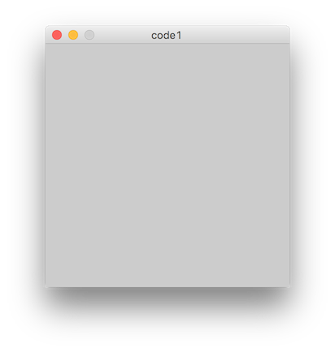
 
## code2:Hintergrundfarbe

```
void setup(){
   size(300,300);
   background(255, 0, 0); // Farbe (RGB zwischen 0 und 255)
}
```

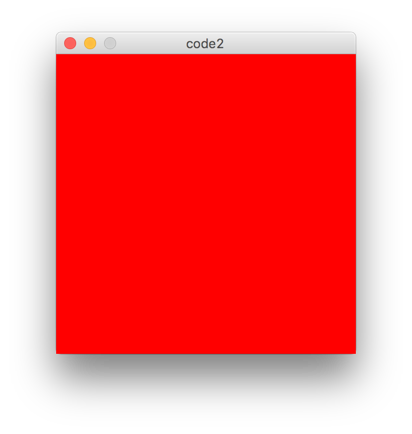

## code3:Linie

```
void setup(){
   size(300, 300);
   background(255, 255, 255);
   line(10,10, 290, 290); // Links-Oben = (0,0)
} 
```

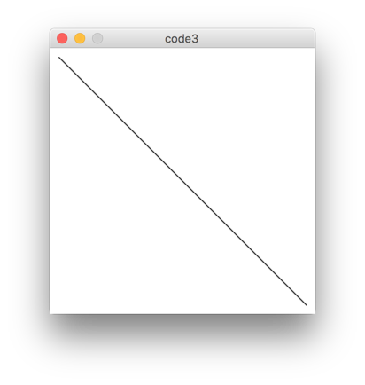

## code4:Kreis

```
void setup(){
   size(300, 300);
   background(255, 255, 255);
   ellipse(150, 150, 100, 100 ); // pos_x, pos_y, breite, höhe
}
```

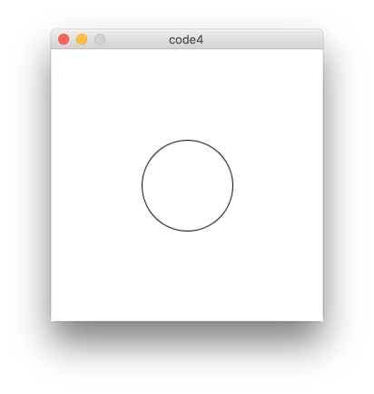

## code5:Japanische Flagge

```
void setup(){
   size(300, 300);
   background(255, 255, 255);
   fill(255, 0, 0); // farbe des Kreises
   ellipse(150, 150, 100, 100 ); 
}

```

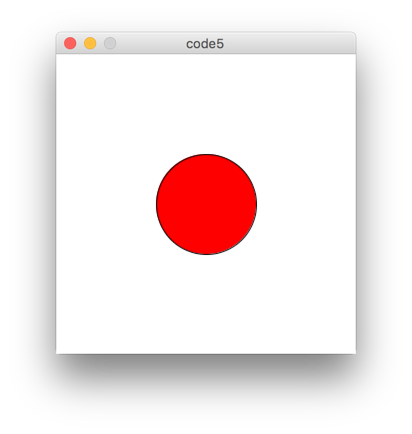

## code6:Ohne Umriss

```
void setup(){
   size(300, 300);
   background(255, 255, 255);
   fill(255, 0, 0); 
   noStroke(); // Ohne Umriss
   ellipse(150, 150, 100, 100 ); 
}
```

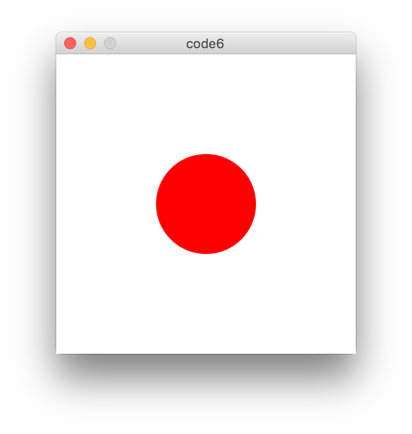

## code7:Nur Umriss

```
void setup(){
   size(300, 300);
   background(255, 255, 255);
   stroke(255, 0, 0);  // farbe des Umrisses
   strokeWeight(10); // dicker!
   noFill(); // nur Umriss
  ellipse(150, 150, 100, 100 ); 
}
```

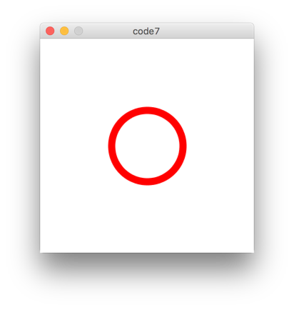

## code8:Mehrere Kreise

```
void setup(){
   size(300, 300);
   background(255, 255, 255);
   stroke(255, 0, 0);  // farbe des Umrisses
   strokeWeight(10); // dicker!
   noFill(); // nur Umriss
  
    // fünf Kreise
   ellipse(50, 150, 100, 100 ); 
   ellipse(100, 150, 100, 100 ); 
   ellipse(150, 150, 100, 100 ); 
   ellipse(200, 150, 100, 100 ); 
   ellipse(250, 150, 100, 100 ); 
}
```

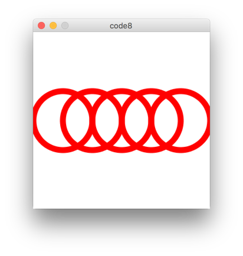

## code9:Print

```
void setup(){
  print("Hello processing");
}
```

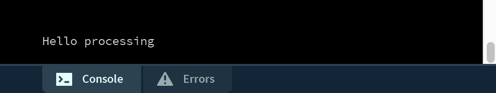

## code10:Variabel

```
void setup(){
  int age = 37;
  print("Hello processing. My age is " + age );
  int next_year = age + 1;
  print(" Next year I will be " + next_year );
}
```


## code11:For-Schleife

```
void setup(){
  int age = 37;
  int year = 2017;
  for(int i = 0; i < 100; i++){
     print("in "+ (year+i) + " I'll be " + (age + i) +" years old\n"); 
  }
}
```

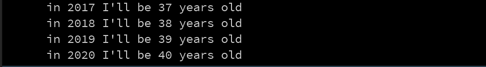

## code12:Mehrere Kreise mit einer For-Schleife

```
void setup(){
   size(300, 300);
   background(255, 255, 255);
   stroke(255, 0, 0);  // farbe des Umrisses
   strokeWeight(5); // dicker!
   noFill(); // nur Umriss
  	for(int i = 0; i < 10; i++){
    ellipse(i * 30, 150, 100, 100 ); 
  }
}
```

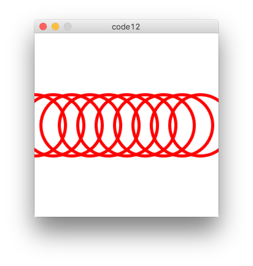

## code13:Farbeänderung

```
void setup(){
   size(300, 300);
   background(255, 255, 255);
   strokeWeight(5); // dicker!
   noFill(); // nur Umriss
  for(int i = 0; i < 10; i++){
    stroke(255 - (i*10), 0, i*20);  // farbe des Umrisses
    ellipse(i * 30, 150, 100, 100 ); 
  }
}
```

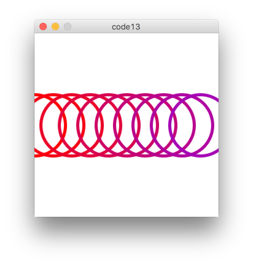

## code14:Randomisierung

```
void setup(){
   size(300, 300);
   background(255, 255, 255);
   strokeWeight(5); // dicker!
   noFill(); // nur Umriss
  	for(int i = 0; i < 10; i++){
  		stroke(255 - (i*10), 0, i*20); 
  		float size = random(130.0) + 20.0;
    	ellipse(i * 30, 150, size, size ); 
  }
}
```

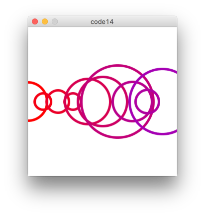


## HA

Programmieren Sie ein Sketch, das folgende Bild generiert.

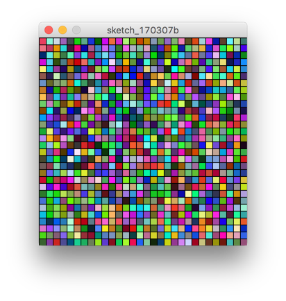

- Die Größe des Fensters 300x300
- 30*30 Quadrate
- Randomisierte Farben

Hinweis: 

- Eine For-Schleife in einer For-Schleife
- [Rect](https://processing.org/reference/rect_.html)
