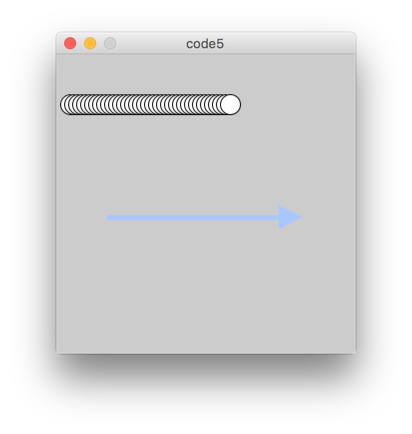
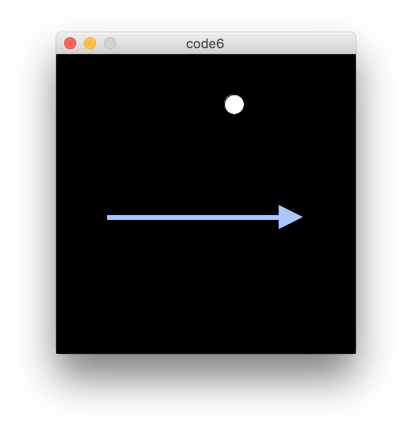
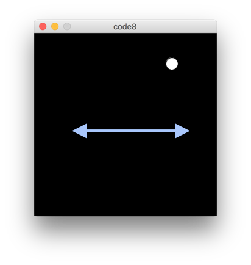

#Klasse1 - Animation

## code1: Setup - führt nur einmal aus

```
void setup(){
   size(300,300);  // Die Größe des Fensters
   print("hello"); // Zeige "hello"  unten an
}
```


 
## code2: Draw - mit Wiederholung (endlos)

```
void setup(){
   size(300,300);  // Die Größe des Fensters
}

void draw(){ // Schtleife
   println("hello"); // mit Wiederholung
}
```


## code3: Variabel außerhalb Funktionen

```
int myNumber = 10; // variabel

void setup(){
   size(300,300);  // Die Größe des Fensters
}

void draw(){ // Schleife
   println(myNumber); // mit Wiederholung
}
```


## code4: Zählung

```
int myNumber = 10; // variabel

void setup(){
   size(300,300);  // Die Größe des Fensters
}

void draw(){ // Schleife
   println(myNumber); // mit Wiederholung
   myNumber += 1;
}
```


## code5: Bewegung

```
int myNumber = 10; // variable

void setup(){
   size(300,300);  // Die Größe des Fensters
}

void draw(){ // Schtleife
   println(myNumber); // mit Wiederholung
   myNumber += 4;
   ellipse(myNumber, 50, 20,20);  
}
```



## code6: Clear

```
int myNumber = 10; // variable

void setup(){
   size(300,300);  // Die Größe des Fensters
}

void draw(){ // Schleife
   clear(); // alle Objekte aufs Fenster löschen
   myNumber += 4;
   ellipse(myNumber, 50, 20,20);  
}
```



## code7: if

```
int myNumber = 10; // variable
int speed = 4;
void setup(){
   size(300,300);  // Die Größe des Fensters
}

void draw(){ // Schtleife
   clear();
   myNumber += speed;
   ellipse(myNumber, 50, 20,20);
   if(myNumber > 300){
      speed = -speed; 
   }
}
```


## code8:Pendel
```
int myNumber = 10; // variable
int speed = 4;
void setup(){
   size(300,300);  // Die Größe des Fensters
}

void draw(){ // Schtleife
   clear();
   myNumber += speed;
   ellipse(myNumber, 50, 20,20);
   if(myNumber > 300){
      speed = -speed; 
   }
   if(myNumber < 0){
      speed = -speed; 
   }
}
```



## code9:Zwei Ballen
```
int ball1 = 10;
int ball2 = 10;
int speed1 = 4;
int speed2 = 7;
void setup(){
   size(300,300);  // Die Größe des Fensters
}

void draw(){ // Schtleife
   clear();
   ball1 += speed1;
   ball2 += speed2;
   ellipse(ball1, 50, 20,20);
   ellipse(ball2, 100, 20,20);

   if(ball1 > 300 || ball1 < 0){ // || = oder
      speed1 = -speed1; 
   }
   if(ball2 > 300 || ball2 < 0){ // || = oder
      speed2 = -speed2; 
   }
}
```

## code10:Array

```
int ball[] = {10,10};
int speed[] = {4,7};

void setup(){
   size(300,300);  // Die Größe des Fensters
}

void draw(){ // Schleife
   clear();
   ball[0] += speed[0];
   ball[1] += speed[1];
   ellipse(ball[0], 50, 20,20);
   ellipse(ball[1], 100, 20,20);

   if(ball[0] > 300 || ball[0] < 0){ 
      speed[0] = -speed[0]; 
   }
   if(ball[1] > 300 || ball[1] < 0){
      speed[1] = -speed[1]; 
   }
}
```

## code11:Zehn Ballen
```
int ball[] = new int[10]; // ein Array mit 10 Elemente
int speed[] = {4,7,1,8,2,3,9,5,4,6,10}; // unterschiedliche Geschwindigkeiten

void setup(){
   size(300,300);  // Die Größe des Fensters
}

void draw(){ // Schleife
   clear();
   for(int i = 0; i < 10; i++){
     ball[i] += speed[i];
     ellipse(ball[i], i*25+20, 20,20);
     if(ball[i] > 300 || ball[i] < 0){ // || = oder
        speed[i] = -speed[i]; 
     }
   }
}
```


## HA: Loopy Space

Programmieren Sie ein Sketch, das die folgende Animation generiert.

[Animation](img/ha.mp4)


