#Klasse3 - Affine Transformation

## code1: Quadrat

```
void setup(){
	size(300,300);
	rect(-20,-20,40,40); // ein Teil nicht sichtbar
}
```

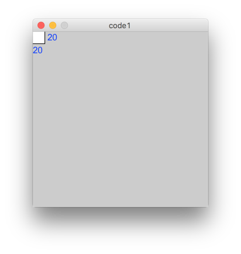
 
## code2: Vershiebung mit translate
```
void setup(){
  size(300,300);
  translate(100, 100); // nach unten +100 , nach rechts +100
  rect(-20,-20,40,40);
}
```
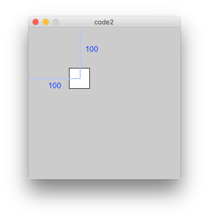

## code3: zwei Rechtecke 

```
void setup(){
  size(300,300);
  translate(100, 100); // nach unten +100 , nach rechts +100
  rect(-20,-20,40,40);
  rect(20, 20, 40, 40); // auch gültig für dieses Quadrat
}
```

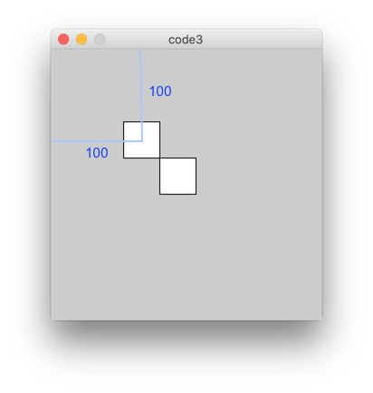

## code4: Animation mit Verschiebung

```
int x = 0;

void setup(){
  size(300,300);
}

void draw(){
  clear();
  translate(x,130);
  rect(-20,-20,40,40);
  x += 5;
}
```

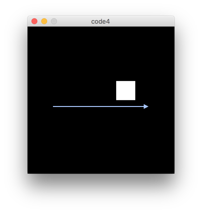

## code5: Sinus + Verschiebung

```
float x = 0;

void setup(){
  size(300,300);
}

void draw(){
  clear();
  translate(sin(x)*100+150,130);
  rect(-20, -20, 40, 40);
  x += 0.08;
}
```

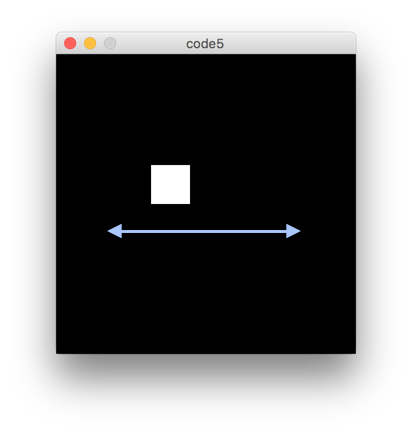

## code6: Kreisbewegung

```
float x = 0;

void setup(){
  size(300,300);
}

void draw(){
  clear();
  translate(sin(x)*100+150,130 + cos(x) * 100);
  rect(-20, -20, 40, 40);
  x += 0.08;
}
```

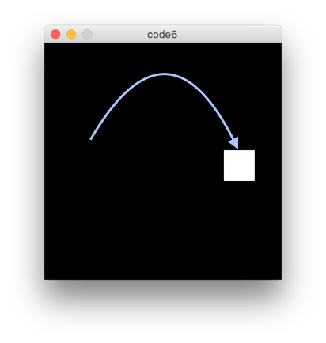

## code7: Skalierung

```
float x = 0;

void setup(){
  size(300,300);
}

void draw(){
  clear();
  translate(150,150);
  scale(sin(x) * 5.0, 1.0);
  //scale(sin(x) * 5.0, cos(x) * 5.0);
  //scale(sin(x) * 5.0, cos(x * 1.333) * 5.0);

  rect(-20, -20, 40, 40);
  x += 0.05;
}
```

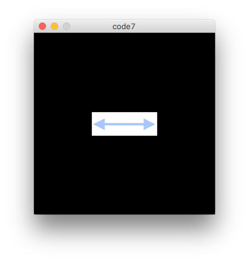

## code8:Drehung
```
float x = 0;

void setup(){
  size(300,300);
}

void draw(){
  clear();
  translate(150,150);
  rotate(x);
  rect(-20, -20, 40, 40);
  x += 0.05;
}
```

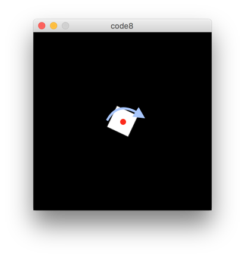

## code9:Drehung und Drehpunkt
```
float x = 0;

void setup(){
  size(300,300);
}

void draw(){
  clear();
  rotate(x);
  translate(150,150); // die Rheinfolge ist wichtig
  rect(-20, -20, 40, 40);
  x += 0.05;
}
```
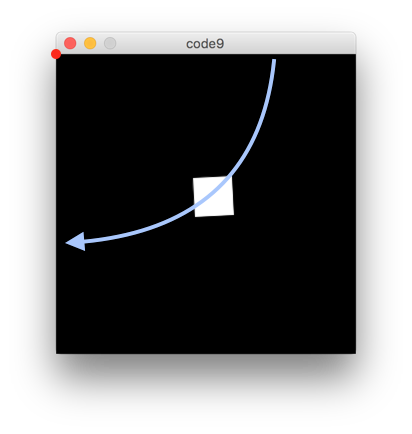

## code10:Sonnensystem

```
float x = 0;

void setup(){
  size(300,300);
}

void draw(){
  clear();
  translate(150,150);
  fill(255,0,0);
  ellipse(0,0,40,40); // Zentrum
  rotate(x);
  translate(100,100); // die Rheinfolge ist wichtig
  fill(0,0,255);
  ellipse(-20, -20, 40, 40);
  x += 0.05;
}
```
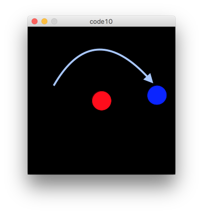

## code11:Unabhengige Bewegungen 1 
```
void setup(){
  size(300,300);
}

void draw(){
  clear();
  translate(100,150);
  ellipse(0,0,40,40);
  translate(200,150);
  ellipse(0,0,40,40);
}
```
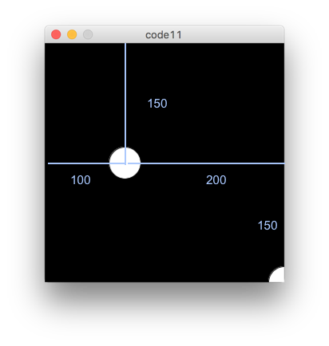

## code12:Unabhengige Bewegungen 2

```
void setup(){
  size(300,300);
}

void draw(){
  clear();
  translate(100,150);
  ellipse(0,0,40,40);
  translate(200,150);
  ellipse(0,0,40,40);
}
```
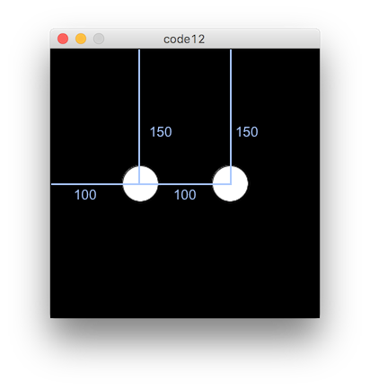

## code13:Unabhengige Bewegungen 3
```
float y = 0;

void setup(){
  size(300,300);
}

void draw(){
  clear();
  
  pushMatrix();
  translate(100,150 + sin(y*3.0) * 100); // die erste Vershiebung
  ellipse(0,0,40,40);
  popMatrix();
  
  pushMatrix();
  translate(200,150 + sin(y) * 100); // unabhängig von der ersten Vershibung
  ellipse(0,0,40,40);
  popMatrix();
  y += 0.05;
}
```
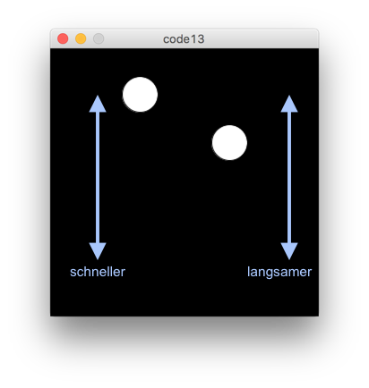

## HA: Blasen

Programmieren Sie ein Sketch, das die folgende Animation generiert.

[Animation](HA/ha.mp4)


