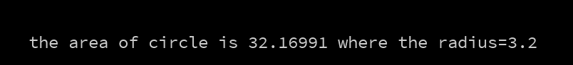

#Klasse7 - Klausur

### Aufgabe 1 (Basis)

Programmieren Sie eine Skizze, die die Flagge Schweiz anzeigt.
**Die Vewendung einer Bilddatei** ist selbstversändlich verboten.


### Aufgabe 2 (Typographie und Schleifen)
Zeigen Sie die Zahlen zwischen 0 bis 99 (10x10 wie Abbildung). Die Quellcode muss kürzer als 20 Zeilen sein.

	- Hinweis: 2x for


### Aufgabe 3 (Funktion)
Mit einer Funktion "calcArea", rechnet die folgende Skizze die Fläche eines Kreises aber die Funktion wurde noch nicht definiert. Definieren Sie die Funktion "calcArea" und ergenzen Sie die Skizze.

```
void setup(){
  float radius = 3.2;
  float area = calcArea(radius);
  println("the area of circle is " + area + " where the radius=3.2");
}
```
Das erwartete Ergebnis:



### Aufgabe 4 (Affine Transformation und Array)

Programmieren Sie eine Skizze, die 50 drehende Rechtecke mit unterschiedlichen Umdrehungsgeschwindigkeiten anzeigt.

[Video](https://youtu.be/nULV9o_85mc)

### Aufgabe 5 (Interaktion)

Die folgende Skizze simuliert den Sekundenzeiger eines Uhrs.
Fürgen Sie folgende interaktive Funktionen hinzu:

- nach dem Druck auf s-Taste : der Sekundenzeiger bewegt sich zweimal schneller als vorher.
- nach dem Druck auf l-Taste : der Sekundenzeiger bewegt sich zwwimal langsammer als vorher

[Video](https://youtu.be/UcwM3JopevU)

```
float angle = 0;
float anglePerFrame = PI*2 /60 / 30;

void setup(){
   size(500,500);
   background(0);
   strokeWeight(3);
   noFill();
}

void draw(){
    clear();
    stroke(255);
    ellipse(250,250,400,400);
    translate(250,250);
    rotate(angle);
    rect(-5,0,10,180);
    angle += anglePerFrame;
}
```
### Aufgabe 6 (Kreative Aufgabe)

Programmieren Sie eine Skizze, die eine Animation eines starken Regens zeigt. Sie können alle Funktionen von Processing **außer der Wiedergabe eines Videos** für diese Aufgabe verwenden.