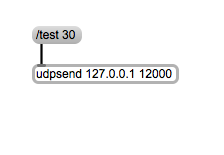

#Klasse4 - Interaktion 

## Code1: Position der Maus

```
void setup(){
  size(300, 300); 
}

void draw(){
  println(mouseX + "   " + mouseY); 
}
```


## Code2: Ein Ball folgt den Cursor

```
void setup(){
  size(300, 300); 
}

void draw(){
  println(mouseX + "   " + mouseY); 
}
```


## Code3: Klick
```
void setup(){
  size(300, 300); 
}

void draw(){
}

void mousePressed(){
   println("mouse pressed! position:" + mouseX + ":" + mouseY); 
}
```


## Code4: Ball Generator
```
void setup(){
  size(300, 300); 
}

void draw(){
}

void mousePressed(){
	ellipse(mouseX, mouseY, 40, 40);
}
```


## Code5: Marlersoftware?
```
void setup(){
  size(300, 300); 
  noStroke(); // ohne Umriss
}

void draw(){
}

void mouseDragged(){
  ellipse(mouseX, mouseY, 40, 40);
}
```


## Code6: Frequenzsteuerung mit Maus
```
float phase = 0.0;
float increment = 0.05;
void setup(){
  size(300, 300); 
}

void draw(){
  float posY = sin(phase) * 100 + 150;
  clear();
  ellipse(150, posY, 40, 40);
  phase += increment;
}

void mouseMoved(){
  increment = mouseX / 1000.0;
}
```


## Code7: Tastatur
```
void setup(){
  size(300, 300); 
}

void draw(){
}

void keyPressed(){
  println(key);
}
```


## Code8: Interaktion mit Tastatur

```
void setup(){
  size(300, 300); 
}

void draw(){
}

void keyPressed(){
  if(key == 'r'){
    background(255,0,0);
  }else if(key == 'g'){
    background(0,255,0);
  }else if(key == 'b'){
    background(0,0,255);
  }
}
```


## Code9: Text auf dem Fenster

```
int position = 10;
void setup(){
  size(300, 300); 
  textSize(32);
  fill(0);
}

void draw(){
}

void keyPressed(){
  
   text(key, position, 150); 
   position += 20;
}
```


## Code10: OSC von Max

```
import oscP5.*;
import netP5.*;
  
OscP5 oscP5;

void setup() {
  size(300,300);
  oscP5 = new OscP5(this,12000);
}

void draw() {
}

void oscEvent(OscMessage theOscMessage) {
  print("addrpattern: "+theOscMessage.addrPattern());
  println("value: "+theOscMessage.get(0).intValue());
}
```



