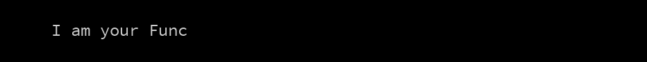
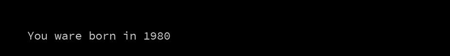
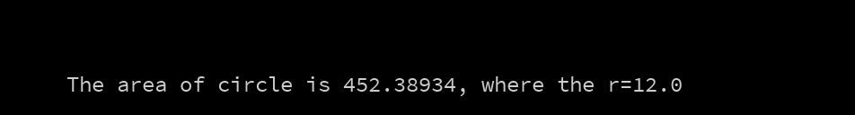
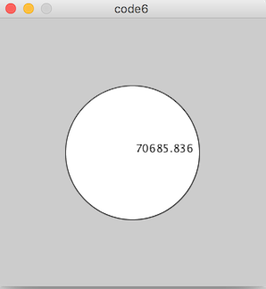
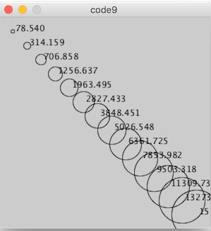
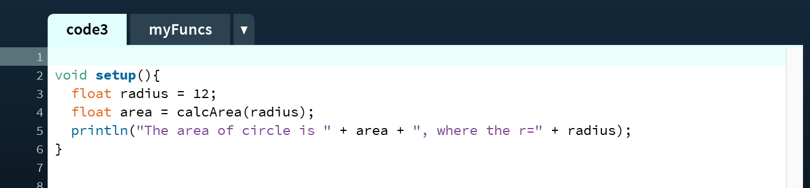
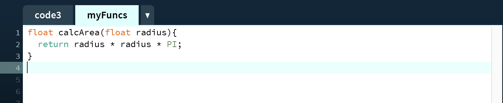

#Klasse5 - Funktion

## Code1: Die erste Funktion

Eine Funktion (englisch function) ist die Bezeichnung eines Programmkonstrukts, mit dem der Programm-Quellcode strukturiert werden kann, so dass Teile der Funktionalität des Programms wiederverwendbar sind. 

### Definition einer Funktion in Processing

*return-type function-name (parameter-type parameter-name)*

z.B.

**int myFunc(int param){}** ... Diese Funktion heißt "myFunc". Die Funktion akkzeptiert einen Integer-Paramter und gibt einen Integer zurück.

**void yourFunc(){}** ... Diese Funktion nimmt keine Parameter und gibt keine Werte zurück.

*void* bedeutet nichts.

```
void setup(){
	yourFunc();
}

void yourFunc(){ // keine Rückgabe keine Parameter
	println("I am your Func");
}
```

## Code2: Funktion mit einem Parameter

```
void setup(){
  calcBirthYearFromAge(37);  // gibt einen Parameter ein
}

void calcBirthYearFromAge(int age){ // keine Rückgabe ein Parameter
  int yearOfBirth = 2017 - age;
  println("You ware born in " + yearOfBirth);
}
```


## Code3: Funktion mit einer Ruckgabe

```
void setup(){
  int yearOfBirth = calcBirthYearFromAge(37);  // gibt einen Parameter ein
  println("You ware born in " + yearOfBirth);
}

int calcBirthYearFromAge(int age){ // eine Rückgabe ein Parameter
  return 2017 - age;
}
```


## Code4: Die Fläche eines Kreises
```
void setup(){ 
  float radius = 12;
  float area = radius * radius * PI;
  println("The area of circle is " + area + ", where the r=" + radius);
}
```


## Code5: mit Funktion

```
float calcArea(float radius){
  return radius * radius * PI;
}

void setup(){ 
  float radius = 12;
  float area = calcArea(radius);
  println("The area of circle is " + area + ", where the r=" + radius);
}
```


## Code6: Zeichnung und Funktion

```
void setup(){
  size(300,300);
  drawLabeledCircle(150);
}

void drawLabeledCircle(float radius){
  ellipse(150,150,radius,radius);
  float area = radius * radius * PI;
  fill(0,0,0);
  text(area, 150,150);
}
```


## Code7: Funktion verwendet eine andere Funktion
```
void setup(){
  size(300,300);
  drawLabeledCircle(150);
}

void drawLabeledCircle(float radius){
  ellipse(150,150,radius,radius);
  float area = calcArea(radius);
  fill(0,0,0);
  text(area, 150,150);
}

float calcArea(float radius){
  return radius * radius * PI;
}
```



## Code8: Funktion mit mehreren Parametern
```
void setup(){
  size(300,300);
  drawLabeledCircle(150, 150, 150);
}

void drawLabeledCircle(float x, float y, float radius){
  ellipse(x,y,radius,radius);
  float area = calcArea(radius);
  fill(0,0,0);
  text(area, x,y);
}

float calcArea(float radius){
  return radius * radius * PI;
}
```


## Code9: Funktion und einer For-schleife
```
void setup(){
  size(300,300);
  for(int i = 0;i < 15; i++){
    drawLabeledCircle(i*20, i*20, i*5);
  }
}

void drawLabeledCircle(float x, float y, float radius){
  noFill();
  ellipse(x,y,radius,radius);
  float area = calcArea(radius);
  fill(0,0,0);
  text(area, x,y);
}

float calcArea(float radius){
  return radius * radius * PI;
}
```



## Tipp: Zweite Seite




Die erste Seite für Hauptprogramm; menschlich einfach lesbar.
Die zweite Seite für Funktionsbibliotheken: mathematische Einzelheiten.


### Bücher über Codingpraxis 
- [Code Complete](https://www.amazon.de/dp/B00JDMPOSY/ref=dp-kindle-redirect?_encoding=UTF8&btkr=1)
- [Clean Code](https://www.amazon.de/dp/B001GSTOAM/ref=dp-kindle-redirect?_encoding=UTF8&btkr=1)

