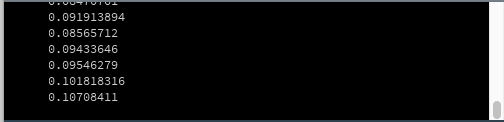
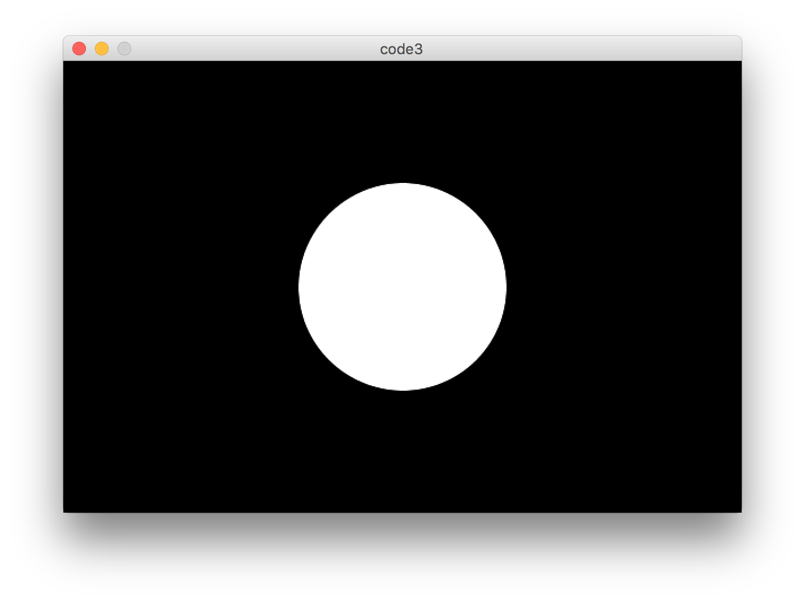
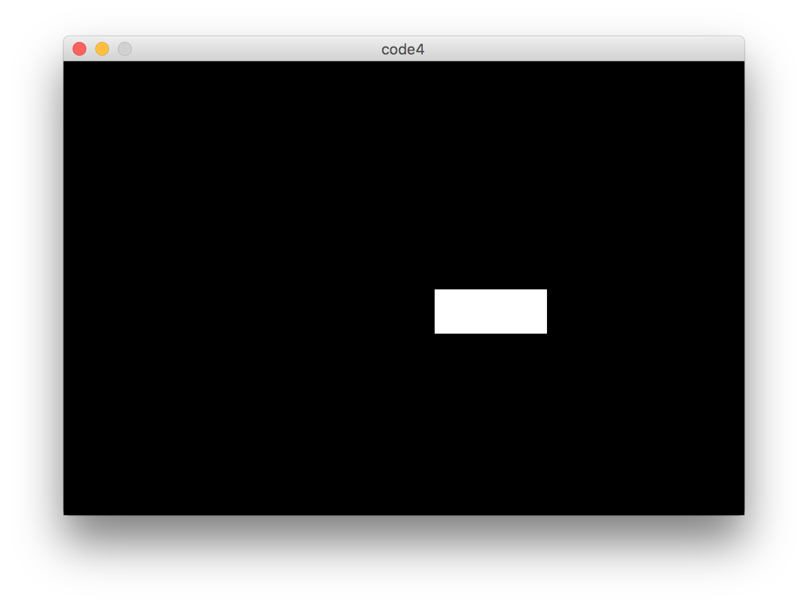
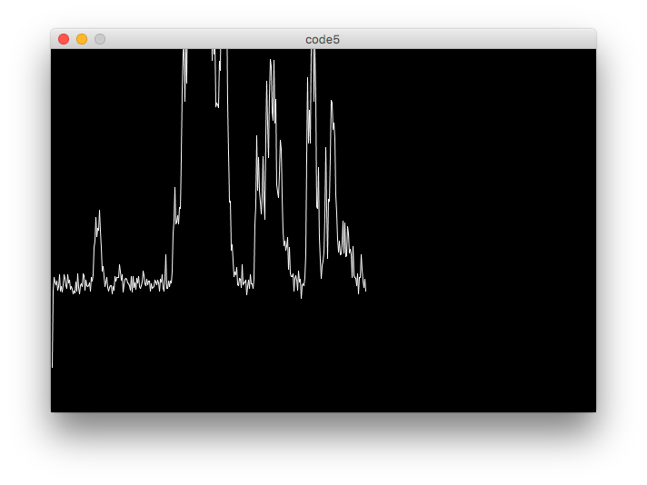
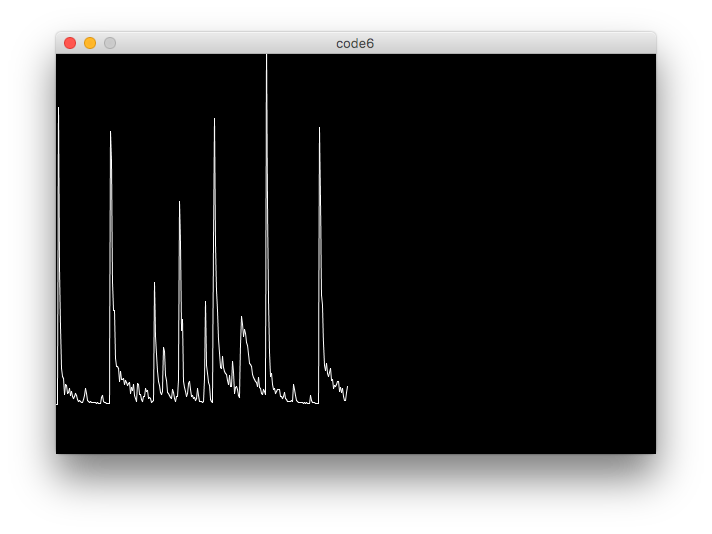
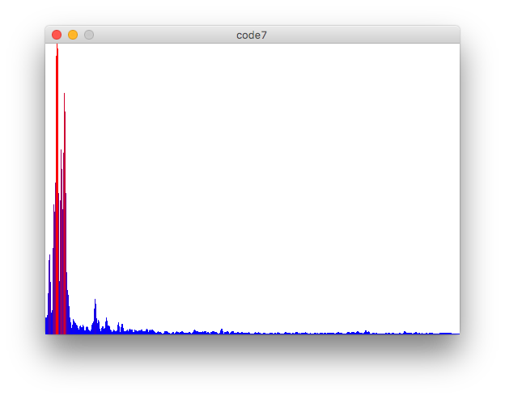

#Klasse6 - Sonifikation

## Code1: Sound Library

```
import processing.sound.*; 
// impotiert die sound library

AudioIn in; 

void setup() {
  size(300, 300);
  in = new AudioIn(this, 0);
  in.play(); // gibt das Signal vom Mikrofon aus. pass auf!
}      

void draw(){
}
```

## Code2: Amplitude Analyze
```
import processing.sound.*;

AudioIn in;  // Mikrofon
Amplitude amp; // Analyzator

void setup() {
  size(300, 300);
  in = new AudioIn(this, 0);
  in.start(); // sendet signal nicht an Lautsprecher
  
  amp = new Amplitude(this);
  amp.input(in);
}      

void draw(){
  println(amp.analyze());
}
```

## Code3: Mapping (Größe)
```
import processing.sound.*;

AudioIn in;  // Mikrofon
Amplitude amp; // Analyzator

void setup() {
  size(600, 400);
  in = new AudioIn(this, 0);
  in.start();
  
  amp = new Amplitude(this);
  amp.input(in);
}      

void draw(){
  clear();
  float result = amp.analyze();
  ellipse(300,200,2500 * result, 2500 * result);
  
}
```


## Code4: Mapping (Beschreunigung)

```
import processing.sound.*;

AudioIn in;  // Mikrofon
Amplitude amp; // Analyzator
float pos = 10;

void setup() {
  size(600, 400);
  in = new AudioIn(this, 0);
  in.start();
  
  amp = new Amplitude(this);
  amp.input(in);
}      

void draw(){
  clear();
  float result = amp.analyze() * 50.0;
  pos += result;
  rect(pos, 200, 100, 40);
  if(pos > 600) pos -= 600;
}
```


## Code5: Plotting

```
import processing.sound.*;

AudioIn in;  // Mikrofon
Amplitude amp; // Analyzator

int index = 1; // x
float previous = 0.0; // der letzte Wert

void setup() {
  size(600, 400);
  background(0);
  in = new AudioIn(this, 0);
  in.start();
  
  amp = new Amplitude(this);
  amp.input(in);
}      

void draw(){
  float result = amp.analyze() * -1000.0; // Y Skalierung
  
  line(index-1, previous+350, index, result+350);
  stroke(255);
  previous = result;
  index++;
  if(index > 600){
     index = 0;
     clear();
  }
}
```


## Code6: mit Sound File
```
import processing.sound.*;

Amplitude amp; // Analyzator
SoundFile file; // Klangdatei

int index = 1; // x
float previous = 0.0; // der letzte Wert

void setup() {
  size(600, 400);
  background(0); // schwerz
  stroke(255); // weiß

  file = new SoundFile(this, "drumLoop.aiff"); // muss mono sein
  file.loop();
  
  amp = new Amplitude(this);
  amp.input(file);
}      

void draw(){
  float result = amp.analyze() * -1000.0; // Y Skalierung

  line(index-1, previous+350, index, result+350);
  previous = result;
  index++;
  if(index > 600){
     index = 0;
     clear();
  }
}

```


## Code7: FFT
```
import processing.sound.*;

FFT fft;
AudioIn in;
int bands = 512; // Anzahl von bin = Aufloesung
float[] spectrum = new float[bands]; // array fuer FFT resultat

void setup() {
  size(512, 360);
  fft = new FFT(this, bands);
  in = new AudioIn(this, 0);
  in.start();
  fft.input(in);
}      

void draw(){
  background(255);
  fft.analyze(spectrum);
  
  for(int i = 0; i < bands; i++){
    float magnitude = spectrum[i] * 10.0;
    stroke(magnitude * 255,0, (1.0-magnitude) * 255);
    line( i, height, i, height - magnitude*height );
  } 
}

```




