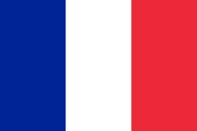
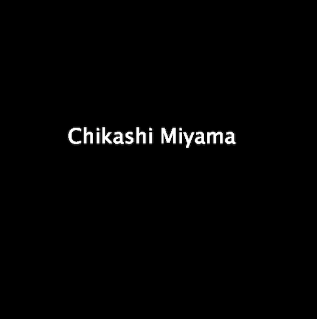
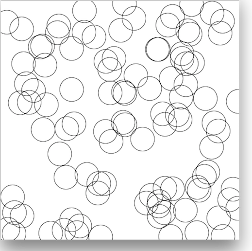
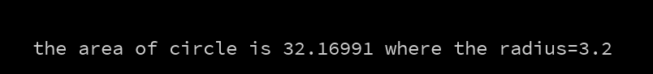

#Klasse7 - Modeltest

### Aufgabe 1 (Basis)

Programmieren Sie eine Skizze, die die Flagge Frankreichs anzeigt.

	- Die Größe des Fensters: 600 x 400 px



### Aufgabe 2 (Typographie)
Zeigen Sie Ihren Namen auf das Fenster.




### Aufgabe 3 (For-Schleife)

Programmieren Sie eine Skizze, die 100 Kreise zeichenet. Die Position jedes Kreises muss randomisiert werden.

	- Die Größe des Fensters: 500 x 500 px
	- Der Radius: 25px



### Aufgabe 4 (Animation)

Programmieren Sie eine Skizze, die eine Pendelbewegung eines Kreieses verwirklicht.

	- Die Größe des Fensters: 500 x 500 px
	- Der Radius: 25px
	- Hinweis: sin

[Video](https://youtu.be/LmIMiTNqv9E)

### Aufgabe 5 (Array)

Programmieren Sie eine Skizze, die die Pendenbewegung von 100 Kreise verwirklicht. Die Geschwindigkeit jedes Kreises muss unterschiedlich sein.

	- Hinweis: Array

[Video](https://www.youtube.com/watch?v=fvszWLX_MvU)

### Aufgabe 6 (Affine Transformation)
Programmieren Sie eine Skizze, die ein drehendes Quadrat zeigt.
Das Quadrat muss genau in der Mitte des Fensters positioniert wird.

	- Hinweis: translate, rotate

[Video](https://www.youtube.com/watch?v=m0dra5rLSno)

### Aufgabe 7 (Interaktion)

Fügen Sie zusäzliche Funktion der Aufgabe#6 hinzu:

Wenn der Benutzer 'p' Taste drückt, stoppt das Quadrat die Drehung. Mit der 's' Taste, kann er die Drehung neu starten.

	- Hinweis: keyPressed

[Video](https://www.youtube.com/watch?v=myaFM3gLd2g)

### Aufgabe 8 (Funktion)

Mit einer Funktion "calcArea", berechnet die folgende Skizze die Fläche eines Kreises aber die Funktion ist noch nicht definiert. Definieren Sie die Funktion "calcArea" und ergenzen Sie die Skizze.

```
void setup(){
  float radius = 3.2;
  float area = calcArea(radius);
  println("the area of circle is " + area + " where the radius=3.2");
}
```


